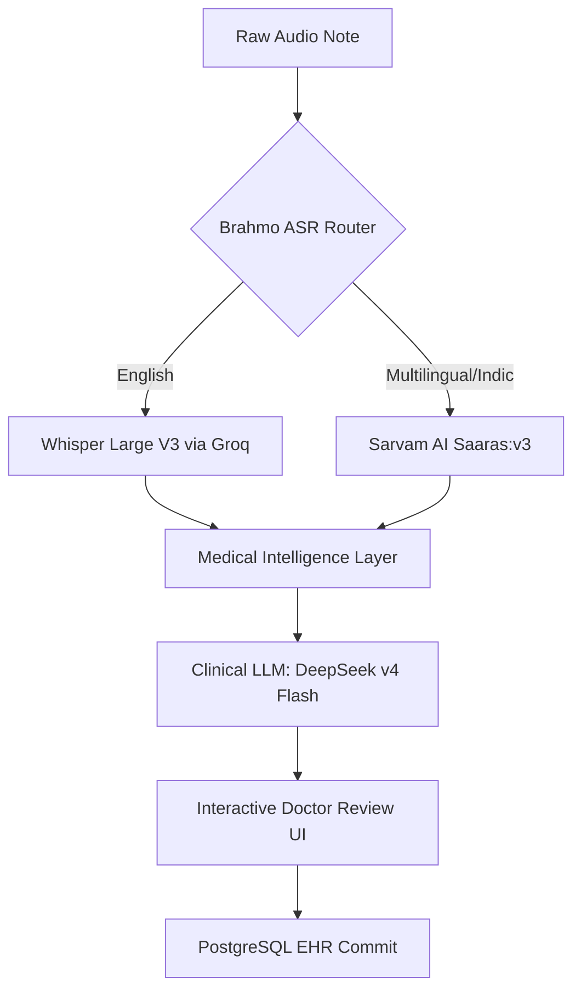

# Brahmo Voice to Nodes Pipeline

An ensembled, multilingual clinical voice capture and knowledge-extraction pipeline built for the Indic healthcare context. It transcribes code-mixed speech, preserves safety negations, extracts structured clinical nodes, and provides an interactive portal for clinician sign-off.

---

## 🚀 Key Features

*   **Indic Code-Switched ASR Routing:** Routes English inputs to **Whisper Large V3 (Groq)** and regional/code-mixed speech (Hindi, Telugu, etc.) to **Sarvam AI (Saaras:v3)** based on the selected language in the portal.
*   **Built-in Romanized Transliteration:** Utilizes Sarvam's `mode=translit` to transcribe Indic speech directly into phonetic English letters, preventing script mismatches and yielding highly accurate Word Error Rate (WER) benchmarks.
*   **Medical Intelligence Correction:** Pre-processes transcripts to fix drug brand names and tag regional critical negations (e.g., Telugu *"ivvaledu"*, Hindi *"mat do"*) before LLM inference.
*   **Clinical Knowledge Extraction:** Uses **DeepSeek-V4-Flash** to classify extracted symptoms, conditions, and allergies into standard clinical nodes (`CONSTRAINT`, `DECISION`, `FACT`, `ANTI_PATTERN`).
*   **Interactive Doctor Review Portal:** An interactive editor where clinicians edit transcripts, add/delete nodes, adjust numerical importance sliders, and sign-off directly to the database.

---

## 🗺️ System Architecture



---

## 📂 Assessment Documentation Directory

I have prepared comprehensive documentation files detailing the evaluation metrics, architecture selections, cost breakdowns, and implementation details:

*   📖 **[ASR Evaluation & Benchmarking Report](https://github.com/AkshayDevX/brahmo-voice-pipeline/tree/main/docs/ASR_EVALUATION_REPORT.md)**: Side-by-side comparison of evaluated ASR models (Whisper, Sarvam, Deepgram, ShunyaLabs), metrics (WER, MTA, Negation Preservation), and rejection rationales.
*   📖 **[Architecture & Cost Analysis Report](https://github.com/AkshayDevX/brahmo-voice-pipeline/tree/main/docs/ARCHITECTURE_AND_COST.md)**: Brahmo ASR Router strategy, base infrastructure costs, and scaling projections (Pilot, Moderate, Scale).
*   📖 **[Technical Walkthrough & Verification](https://github.com/AkshayDevX/brahmo-voice-pipeline/tree/main/docs/WALKTHROUGH.md)**: Deep dive into chunking logic, negation handling, database mappings, and interactive review workflows.
*   📖 **[Pipeline Data Sources & Lexicons](https://github.com/AkshayDevX/brahmo-voice-pipeline/tree/main/docs/data_source.md)**: Overview of ASR test data, phonetic medical dictionaries, Indic negations, name databases, and regional number conversions.
*   📖 **[Clinical Pipeline & Benchmark Corrections](https://github.com/AkshayDevX/brahmo-voice-pipeline/tree/main/docs/PIPELINE_CORRECTIONS.md)**: Detailed changelog of medical intelligence corrections, ASR code-switch parameters, regional numbers unit contexts, and safety negation scopes.


## 📡 Indic Conformer Microservice

The local self-hosted fallback model is powered by AI4Bharat's **Indic-Conformer**, running as a FastAPI microservice. Since a full setup guide is provided in its repository, refer to the [Brahmo Voice Pipeline FastAPI Repository](https://github.com/AkshayDevX/brahmo-voice-pipeline-fastApi.git) to deploy it locally or on-premise.

---

## 🛠️ Setup & Running Locally

### Prerequisites
*   [Node.js](https://nodejs.org/) (v20+ recommended) installed.
*   Supabase PostgreSQL database connection URL.
*   API keys for Groq, Sarvam AI, and Gemini (baselines) configured.

### Environment Setup
Create a `.env.local` file inside the `brahmo-voice-pipeline` folder:
```env
DATABASE_URL=your_postgres_connection_url
GROQ_API_KEY=your_groq_api_key
SARVAM_API_KEY=your_sarvam_api_key
GEMINI_API_KEY=your_gemini_api_key
```

### 1. Install Dependencies
```bash
npm install
```

### 2. Run Database Migrations
Deploy schemas for `transcripts`, `knowledge_nodes`, `accuracy_results`, `asr_evaluations`, and `cost_analysis`:
```bash
npm run db:push
```

### 3. Run the Dev Server
```bash
npm run dev
```
Open [http://localhost:3000](http://localhost:3000) to view the Benchmarking & Doctor Review Portal.

---

## 📊 Running Benchmarks

To run the automated ASR accuracy metrics and node evaluations against the 20 code-mixed clinical test notes:
```bash
npx tsx scripts/run_benchmarks.ts
```
*Calculated metrics (WER, MTA, Negation Preserved, Node Accuracy) will be saved directly to the PostgreSQL `accuracy_results` table.*
