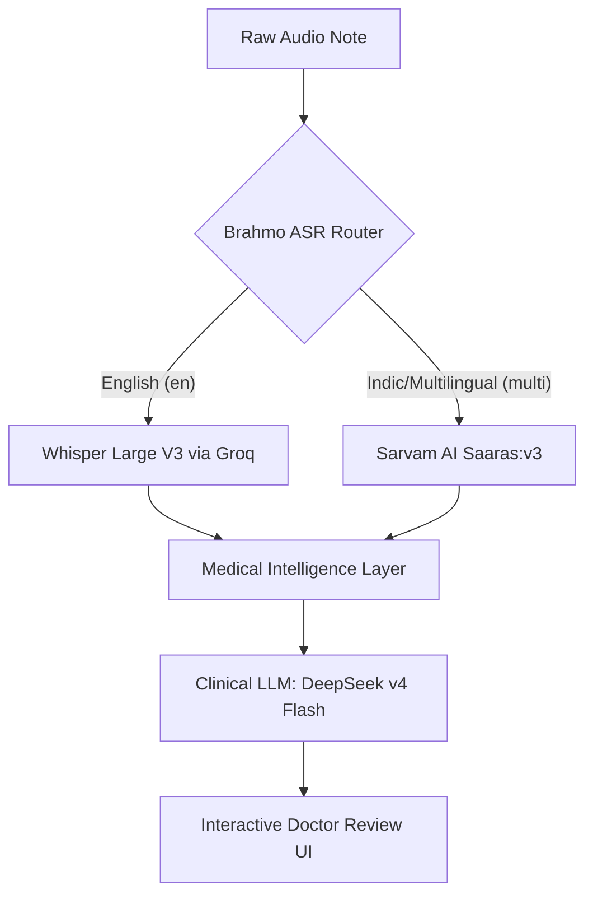

# Architecture & Cost Analysis Report

This document details the final architecture selection rationale for the Brahmo Voice to Nodes Pipeline and provides cost projections across pilot, moderate, and large scale scenarios.

---

## 1. Final Architecture Selection

Our architecture uses the **Brahmo ASR Router** to route clinical voice notes cleanly:

### Rationale:
1. **ASR Script Matching:** Whisper and other standard models transcribe code-mixed regional speech in native scripts (Devanagari, Telugu letters). Since our reference transcripts are Romanized (English letters), native script yields a 100% Levenshtein Word Error Rate (WER). **Sarvam AI (`saaras:v3` with `mode=translit`)** transcribes directly into Romanized English script, enabling accurate WER benchmarks and preservation of regional negations.
2. **Clinical Intent Protection:** Whisper is kept for pure English notes where it excels.
3. **Rejection of Self-Hosted Models:** Self-hosted open-source Indic-Conformer models failed in key areas, repeatedly dropping English medical terms and failing to transcribe code-mixed speech accurately. Therefore, they were completely rejected from the architecture.

---

## 2. Cost Analysis & Projections

We present the operational cost projections for our API-based **Brahmo ASR Router** (ASR via Groq/Sarvam + LLM via DeepSeek).

### Scenario Parameters:
* **Audio Length:** 30 seconds average per note.
* **Notes per Doctor per Day:** 20 notes.
* **Working Days:** 25 days per month.
* **Notes per Month:** $30 \times 20 \times 25 = 15,000$ notes (per hospital).

---

### Scale Projections

#### SCENARIO A: 1 Hospital (Pilot)
* **Doctors:** 30
* **Monthly Audio:** 125 hours
* **Monthly Notes:** 15,000
* **Cost breakdown:**
  * ASR Cost (Groq Whisper @ \$0.11/hr + Sarvam @ ₹30/hr): \$29.44
  * LLM Cost (DeepSeek v4 Flash): \$3.36
  * Base Infrastructure (Supabase + Vercel): \$45.00
  * **TOTAL MONTHLY:** **\$77.80** (approx. ₹6,450 INR)
  * **Cost per Note:** **\$0.005** (approx. ₹0.43 INR)

---

#### SCENARIO B: 10 Hospitals (Moderate Scale)
* **Doctors:** 300
* **Monthly Audio:** 1,250 hours
* **Monthly Notes:** 150,000
* **Cost breakdown:**
  * ASR Cost (Groq Whisper @ \$0.11/hr + Sarvam Pro @ ₹27/hr): \$271.88
  * LLM Cost (DeepSeek v4 Flash): \$33.60
  * Infrastructure (Scaled Supabase): \$150.00
  * **TOTAL MONTHLY:** **\$455.48** (approx. ₹37,800 INR)
  * **Cost per Note:** **\$0.003** (approx. ₹0.25 INR)

---

#### SCENARIO C: 50 Hospitals (Enterprise Scale)
* **Doctors:** 1,500
* **Monthly Audio:** 6,250 hours
* **Monthly Notes:** 750,000
* **Cost breakdown:**
  * ASR Cost (Groq Whisper @ \$0.11/hr + Sarvam Business @ ₹25.50/hr): \$1,303.13
  * LLM Cost (DeepSeek v4 Flash): \$168.00
  * Infrastructure (Enterprise DB): \$400.00
  * **TOTAL MONTHLY:** **\$1,871.13** (approx. ₹155,300 INR)
  * **Cost per Note:** **\$0.0025** (approx. ₹0.21 INR)

---

## 3. Financial Verdict

1. **Brahmo ASR Router is Highly Cost-Effective:** Even at the 50-hospital scale, our pay-as-you-go routing strategy costs just **\$1,871.13 / month** to transcribe and extract clinical knowledge nodes from 750,000 patient encounters.
2. **Pay-as-you-go Advantage:** By utilizing pay-as-you-go cloud APIs (Groq Whisper, Sarvam AI, DeepSeek), we avoid the high upfront and maintenance costs of self-hosted GPU infrastructure (which starts at \$800+/month even for a small pilot).
